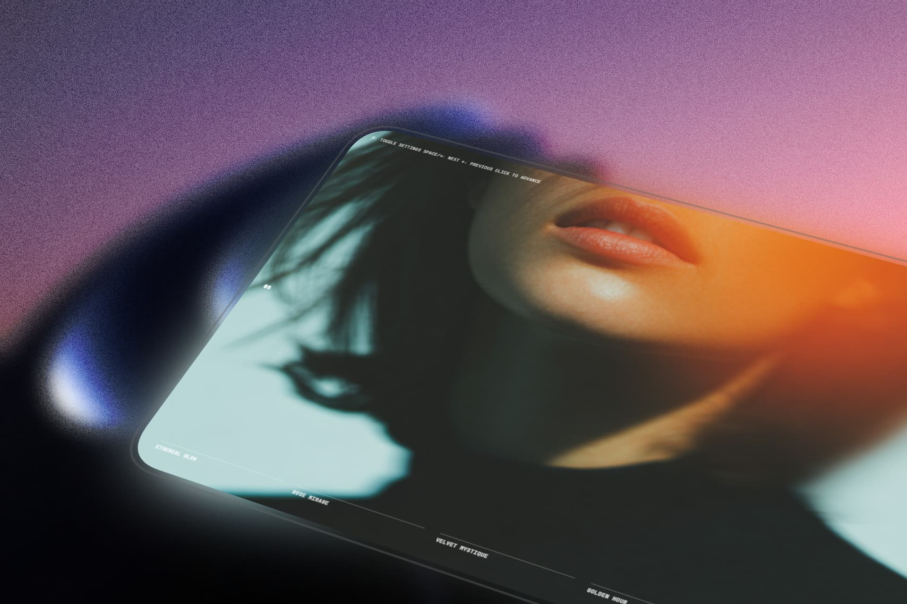

# 🖼️ WebGL Slider Effects

  

## 📖 Description
A high-performance, interactive image slider built with **WebGL** and **GSAP**. This project demonstrates advanced visual effects and smooth transitions between slides, creating a highly engaging and modern user experience. It leverages WebGL for rendering complex shader effects and GSAP for fluid UI animations. 🚀

## ✨ Features
- 🌌 **WebGL Transitions:** Complex, shader-based image transition effects.
- ⚡ **GSAP Animations:** Smooth and performant UI animations.
- 🎮 **Interactive Controls:** Navigate using Keyboard (Spacebar, Arrows), Mouse clicks, or the built-in navigation UI.
- ⚙️ **Customizable Settings:** Toggleable settings menu (Press `H`) to adjust visual parameters.
- 📱 **Responsive Design:** Adapts to different screen sizes.

## 🛠️ Technologies Used
- 🌐 HTML5 / CSS3
- 🟨 JavaScript (ES6 Modules)
- 🧊 WebGL (Three.js)
- 🟢 GSAP (GreenSock Animation Platform)

## 🚀 Getting Started
Simply open the `index.html` file in your preferred modern web browser, or serve it using a local development server like VS Code's Live Server.

## 🕹️ Controls
- `Space` / `→` : Next Slide
- `←` : Previous Slide
- `Click` : Advance Slide
- `H` : Toggle Settings Menu

## 👨‍💻 Author
Created by [Sebastian Vasquez](https://sebas-dev.vercel.app/) 💻
